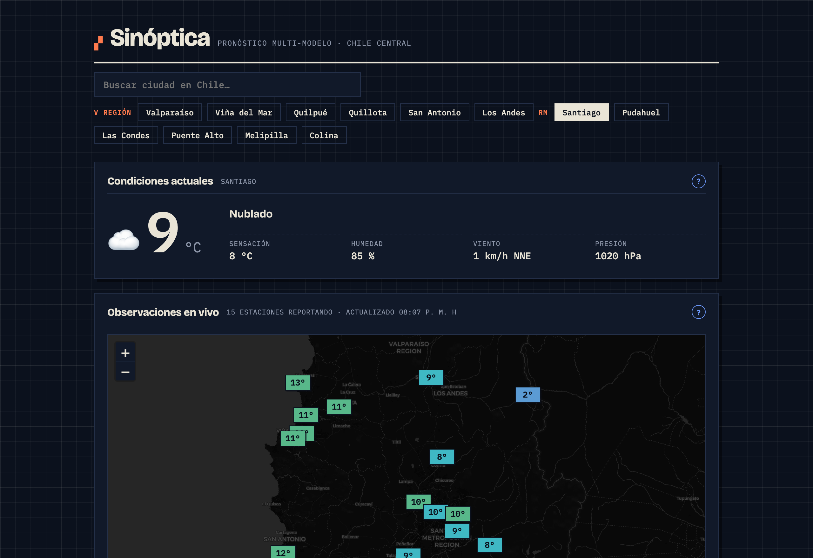
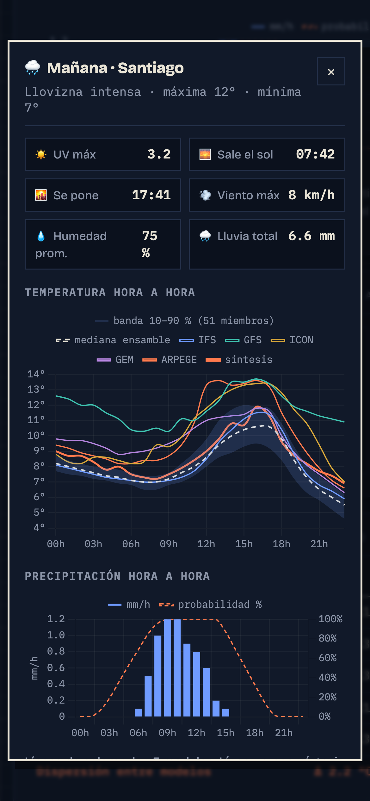
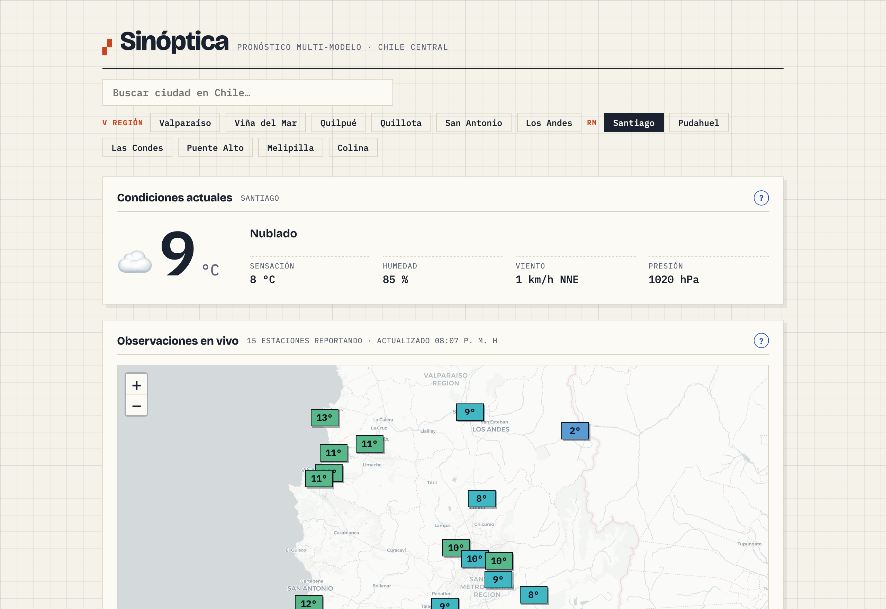

<div align="center">

# 🌤️ Sinóptica

**Pronóstico del tiempo multi-modelo, con incertidumbre honesta, verificación pública y centro de riesgos naturales, para todo Chile.**

[](https://clima.cavara.cl)
[](LICENSE)
[](https://clima.cavara.cl)



</div>

## Por qué existe

Casi todas las apps de clima muestran **un solo número**, de **un solo modelo**, **sin decir cuánto aciertan**. Sinóptica hace lo contrario, sobre tres pilares:

1. **Incertidumbre real.** Usa el ensamble del ECMWF (51 escenarios) para mostrar una banda de confianza, no una falsa certeza. Banda angosta = alta confianza; banda ancha = la atmósfera está difícil y cualquier número exacto sería mentira.
2. **Seis modelos, no uno.** ECMWF IFS, NOAA GFS, DWD ICON, ECCC GEM, Météo-France ARPEGE y ECMWF AIFS (el modelo de IA del ECMWF), lado a lado. Cuando discrepan, lo verás: el desacuerdo *es* información.
3. **Verificación pública.** Cada pronóstico se archiva y luego se compara con lo que **realmente midieron** las estaciones. La app publica su propio error (MAE y sesgo) por modelo y por plazo. Casi nadie en el mundo lo hace.

Todo con APIs **gratuitas y abiertas**, sin claves para el usuario, sin tracking, sin CDNs de terceros, sin costo de operación.

> **Foco geográfico:** Chile completo. La capa científica —observaciones reales y verificación— se apoya en una red curada de 152 estaciones distribuidas en las 16 regiones, incluidas Isla de Pascua (Rapa Nui) y la Antártica chilena.

## Capturas

| Detalle por día (móvil) | Escritorio (claro) |
|---|---|
|  |  |

## Características

- 📈 **Banda de ensamble** (10–90 %, 51 miembros) + 6 modelos deterministas superpuestos (incluido el modelo de IA del ECMWF, AIFS).
- 🌫️ **Calidad del aire** con la **medición oficial de la red SINCA** (Ministerio del Medio Ambiente) de la estación más cercana y su índice **ICAP** (D.S. 12/2011): nivel, color y consejo de salud, más el pronóstico de MP2,5 a 48 h — el contaminante crítico del invierno en Chile central.
- 🗺️ **Mapa de observaciones en vivo** con dos capas: temperatura (red nacional de 152 estaciones) y calidad del aire (27 estaciones SINCA por nivel ICAP).
- 🔍 **Detalle hora a hora** al tocar cualquier día: temperatura multi-modelo, precipitación, UV, sol, viento.
- 🎯 **Panel de verificación** con el acierto de cada modelo por plazo (1 a 4 días), actualizado solo.
- ℹ️ **Explicaciones en cada panel**, en doble registro: simple para cualquiera, riguroso para curiosos (qué significa de verdad «70 % de lluvia», qué es el ensamble, por qué los modelos difieren…).
- 📱 **PWA instalable**, responsive, con modo claro/oscuro automático y funcionamiento offline del último pronóstico visto.

### Centro de riesgos

- 🌎 **Sismos** (CSN + USGS): catálogo reciente en el mapa. Sin pronóstico de terremotos — nadie puede predecirlos — pero sí una estimación de réplicas vía la **ley de Omori**, que es estadística, no predicción puntual.
- 🔥 **Incendios activos** vía **NASA FIRMS** (detección satelital de focos de calor).
- 🚨 **Alertas vigentes de SENAPRED**, el organismo oficial de protección civil de Chile.
- 🌋 **Semáforo volcánico** con el estado técnico de cada volcán activo según la **RNVV de SERNAGEOMIN**.
- 🏥 **Infraestructura de emergencia** (albergues, puntos de encuentro, capacidad de respuesta) tomada del visor oficial **Chile Preparado** de SENAPRED.

## Cómo funciona

```
┌─────────────────────────────┐         ┌──────────────────────────────┐
│  web/  (PWA estática)        │         │  ingesta/  (Python stdlib)   │
│  habla directo con Open-Meteo│         │  cron horario en contenedor  │
│  Chart.js · Leaflet · vanilla│         │                              │
└─────────────────────────────┘         │  • pronósticos (6 modelos +  │
            │                            │    ensamble de 51 miembros)  │
            │ lee JSON                   │  • observaciones (METAR+DMC) │
            ▼                            │  • verificación (MAE/sesgo)  │
   status / verificacion /  ◄────────────│  → SQLite + JSON públicos    │
   estaciones / aire /                   └──────────────────────────────┘
   bias .json
```

- **Frontend** (`web/`): HTML/CSS/JS sin framework. Pinta el pronóstico consumiendo Open-Meteo desde el navegador, y enriquece con los JSON que genera la ingesta.
- **Ingesta** (`ingesta/`): Python 3.12 **solo librería estándar** (`urllib` + `sqlite3`, cero dependencias). Archiva pronósticos y observaciones, y computa la verificación. Ese archivo histórico es el activo que habilitará la calibración local (MOS/EMOS).
- **Deploy** (`deploy/` + `docker-compose.yml`): nginx endurecido + contenedor de cron. Pensado para correr detrás de un Cloudflare Tunnel, sin abrir puertos.

## Correr en local

```bash
# 1. Un ciclo de ingesta (crea data/clima.db y los JSON en web/)
python3 ingesta/run.py --all

# 2. Servir la PWA
python3 -m http.server 8123 -d web   # → http://localhost:8123
```

No necesitas claves: las observaciones llegan por METAR (NOAA, abierto). Para añadir las 10 estaciones automáticas de la DMC, copia `.env.example` a `.env` con tu token del [registro gratuito](https://climatologia.meteochile.gob.cl).

## Desplegar

```bash
docker compose up -d        # web (nginx) + ingesta (cron)
```

El cron archiva observaciones cada hora y pronósticos cada 6 h. Detalle de operación, seguridad y el flujo exacto de actualización en [`docs/DEPLOY.md`](docs/DEPLOY.md).

## Fuentes de datos

| Fuente | Aporta | Licencia |
|---|---|---|
| [Open-Meteo](https://open-meteo.com/) | Pronóstico de 6 modelos (incluido AIFS) + ensamble ECMWF | CC BY 4.0 |
| [Dirección Meteorológica de Chile](https://climatologia.meteochile.gob.cl/) | Observaciones de estaciones automáticas (EMA) | Uso público con atribución |
| Red OMM / METAR vía [NOAA AWC](https://aviationweather.gov/) | Observaciones horarias de aeropuertos | Dominio público |
| [SINCA](https://sinca.mma.gob.cl/) (Ministerio del Medio Ambiente) | Calidad del aire oficial (MP2,5, MP10, ICAP) | Uso público con atribución |
| [CAMS](https://atmosphere.copernicus.eu/) (Copernicus) vía Open-Meteo | Pronóstico de calidad del aire | CC BY 4.0 |
| [CSN](https://xor.cl/) (Centro Sismológico Nacional) | Catálogo sísmico de Chile | Datos públicos del Estado de Chile |
| [USGS](https://earthquake.usgs.gov/fdsnws/event/1/) (FDSN Event) | Catálogo sísmico global (respaldo) | Dominio público |
| [NASA FIRMS](https://firms.modaps.eosdis.nasa.gov/) | Focos de calor / incendios activos (detección satelital) | Cita NASA FIRMS |
| [SENAPRED](https://senapred.cl/) (ArcGIS) | Alertas vigentes e infraestructura de emergencia (Chile Preparado) | Datos públicos del Estado de Chile |
| [SERNAGEOMIN](https://rnvv.sernageomin.cl/) (RNVV) | Semáforo de alerta técnica volcánica | Datos públicos del Estado de Chile |

## Hoja de ruta

- [x] PWA multi-modelo con banda de ensamble
- [x] Ingesta y archivo histórico (SQLite)
- [x] Mapa de observaciones en vivo
- [x] Verificación pública (MAE/sesgo por modelo y plazo)
- [x] Calidad del aire con índice ICAP chileno
- [x] Mediciones oficiales SINCA (estación más cercana como dato real)
- [x] Mapa de calidad del aire con todas las estaciones SINCA por ICAP
- [x] **Calibración local, fase 1**: corrección de sesgo por estación/variable (EWMA + gate de muestra + shrinkage → `bias.json`)
- [x] Red nacional de 152 estaciones (16 regiones + Rapa Nui + Antártica)
- [x] Modelo de IA del ECMWF (AIFS) como 6.º modelo determinista
- [x] **Centro de riesgos**: sismos (CSN/USGS + réplicas de Omori), incendios (NASA FIRMS), alertas SENAPRED, semáforo volcánico RNVV e infraestructura de emergencia (Chile Preparado)
- [ ] **Calibración local, fases siguientes**: EMOS → ML cuantílico (requiere más archivo histórico)
- [ ] Modelo regional chileno WRF de la DMC (4 km) como 7.º modelo
- [ ] Índice UV y alertas configurables

La visión técnica completa está en [`PROPUESTA.md`](PROPUESTA.md).

## Stack

Vanilla JS · [Chart.js](https://www.chartjs.org/) · [Leaflet](https://leafletjs.com/) · Python (stdlib) · SQLite · nginx · Docker. Fuentes [Bricolage Grotesque](https://fonts.google.com/specimen/Bricolage+Grotesque) e [IBM Plex Mono](https://fonts.google.com/specimen/IBM+Plex+Mono), todo vendorizado (sin CDNs).

## Licencia

Código bajo [MIT](LICENSE). Los datos meteorológicos mantienen sus licencias de origen y exigen atribución, presente en la interfaz. Proyecto open source **sin fines comerciales**, hecho en Chile. 🇨🇱
