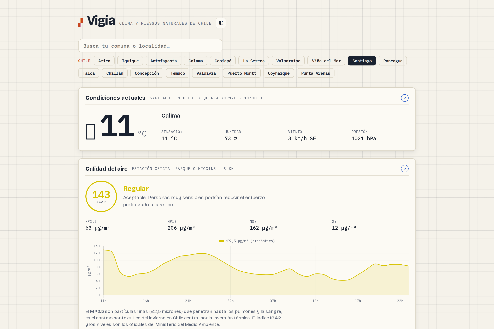
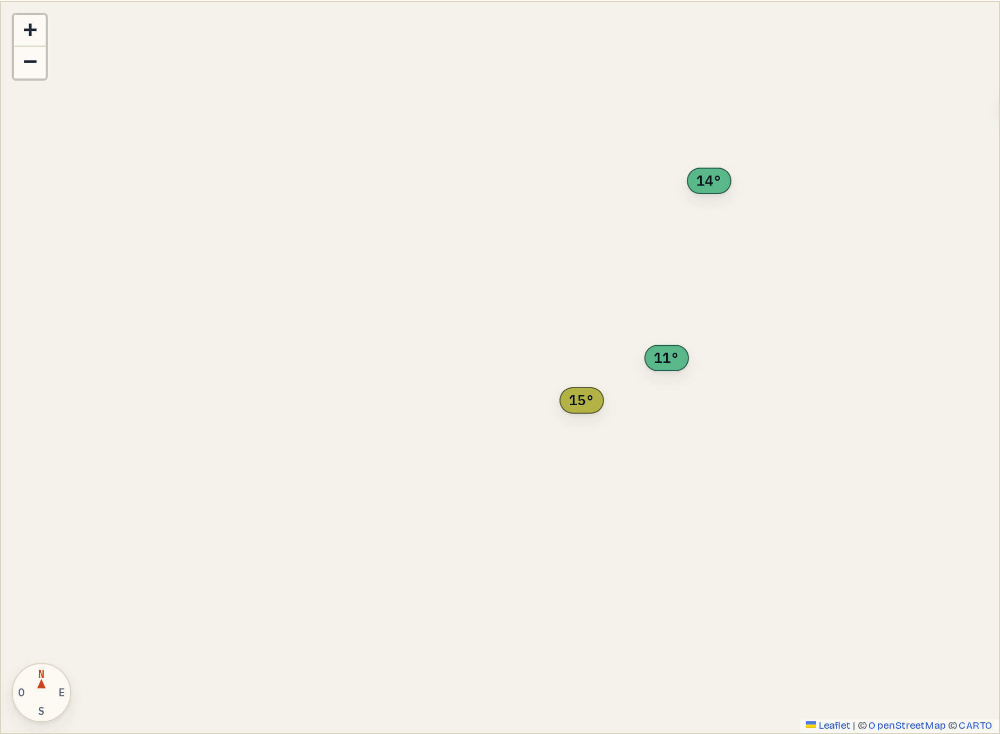
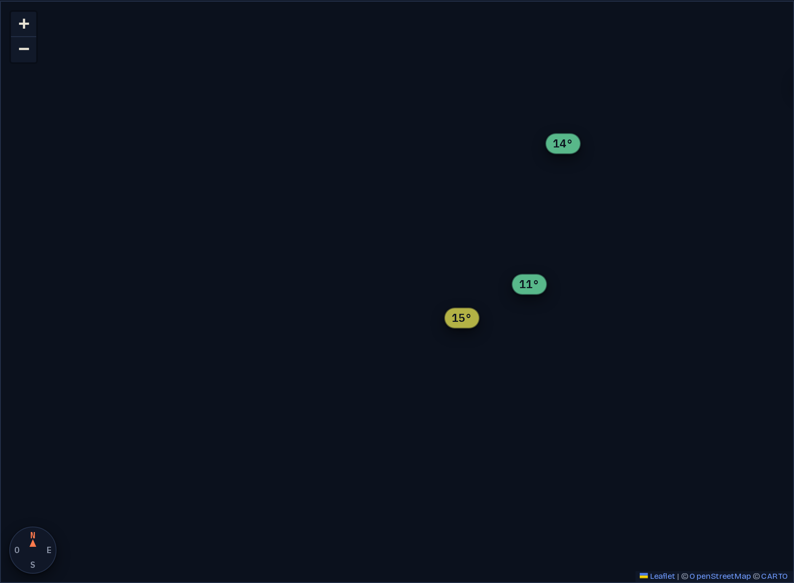

<div align="center">

# 🌎 Vigía

**Clima verificable y centro de riesgos naturales para todo Chile — gratis, sin publicidad, sin tracking.**

[](https://vigia.cavara.cl)
[](LICENSE)
[](https://vigia.cavara.cl)
[](ingesta/)
[](https://vigia.cavara.cl)

<picture>
  <source media="(prefers-color-scheme: dark)" srcset="docs/hero-dark.png">
  
</picture>

| Mapa (modo claro) | Mapa (modo oscuro) |
|---|---|
|  |  |

</div>

## ¿Qué es?

Vigía es una PWA gratuita que junta, en un solo mapa de Chile, el pronóstico del tiempo con verificación pública y un centro de riesgos naturales (sismos, incendios, alertas, volcanes) más la infraestructura de emergencia más cercana. Sin publicidad, sin cuentas, sin tracking, código abierto bajo MIT.

## Características

### 🌤️ Clima verificable

- **6 modelos, no uno**: ECMWF IFS, **AIFS** (el modelo de IA del ECMWF), NOAA GFS, DWD ICON, ECCC GEM y Météo-France ARPEGE, más el **ensamble de 51 miembros** del ECMWF para mostrar una banda de incertidumbre real en vez de un número falso.
- **Pronóstico diario a 14 días**: el resumen diario usa el modelo *best-match* de Open-Meteo. La comparación de los 6 modelos, el ensamble y la calibración de sesgo siguen acotados a 72 horas, porque la fuente del histórico de sesgo no expone leads más allá de eso.
- **Pronóstico propio «Vigía»**: un blend de los 2 modelos con mejor verificación por estación y plazo, ponderado por su error (1/MAE²) y corregido por sesgo — en holdout le gana tanto al blend de los 6 modelos como a cualquiera de ellos por separado.
- **Verificación pública**: cada pronóstico se archiva y se compara luego con lo que midieron las estaciones. La app publica su propio error (MAE, RMSE, sesgo) por modelo y por plazo.
- **Calibración con disciplina científica**: corrección de sesgo por estación con EWMA, gate de muestra mínima y shrinkage — nunca sobre variables donde no corresponde (precipitación, dirección del viento).
- **152 estaciones reales**: las 16 regiones continentales, Isla de Pascua (Rapa Nui), Juan Fernández y 11 bases antárticas chilenas.
- **Buscador de las 345 comunas** de Chile.
- **Calidad del aire** con la medición oficial de la red SINCA y el índice ICAP (D.S. 12/2011).

### 🚨 Centro de riesgos

- **Sismos** (CSN + USGS) en tiempo real, actualizados cada 10 minutos, con estimación de réplicas vía la **ley de Omori** (estadística, no predicción puntual) y el impacto potencial estimado por **PAGER** (USGS).
- **Vigilancia de tsunami cada 10 minutos**: feed del **PTWC (NOAA)** cruzado con el catálogo sísmico propio, con banner en el sitio y notificación push cuando hay amenaza — dejando explícito que la autoridad oficial para Chile es el **SHOA/SNAM**, no el PTWC.
- **Incendios activos** vía **NASA FIRMS** (detección satelital VIIRS, 375 m de resolución), con **dirección probable de avance del fuego** estimada a partir del viento medido en la estación más cercana.
- **Alertas vigentes de SENAPRED** explicadas en lenguaje claro, no solo el aviso oficial crudo.
- **Semáforo volcánico** con el estado técnico de cada volcán activo según la RNVV de SERNAGEOMIN (best effort: la red no publica en tiempo real).
- **Avisos Vigía propios** (viento, **ráfagas**, helada, lluvia, **lluvia persistente**, **caída de presión**, calor, **ola de calor**, **ola de frío**, nieve, **nieve en cota baja**, **riesgo aluvional**, **tormenta eléctrica**, **UV** y **riesgo de incendio**) derivados de la mediana multi-modelo — explícitamente **no oficiales**. El aviso de lluvia persistente mide el acumulado de 48 h (temporales largos que saturan el suelo sin cruzar nunca el umbral de 24 h) y se emite además del aviso de 24 h si ambos cruzan. El aviso aluvional combina lluvia intensa con isoterma 0° alta: cuando la cordillera recibe agua líquida en vez de nieve, crece el riesgo de crecidas repentinas; nieve en cota baja es el mismo compuesto con umbrales para nieve en rutas y ciudades del centro-sur. El de caída de presión detecta ciclogénesis explosiva (24 hPa/24h) como precursor del temporal de viento, antes de que la ráfaga aparezca en el pronóstico. Ola de calor/frío exigen 3+ días consecutivos (no solo un pico puntual). Tormenta usa CAPE como condición necesaria (no suficiente) de convección severa, y UV sigue la escala OMS (9 = muy alto, 11 = extremo). El de incendio aplica la regla 30-30-30 (temperatura, humedad y viento extremos a la vez). Cada aviso incluye el acuerdo entre modelos individuales como señal de confianza, y viento/calor ajustan su umbral al percentil 98 de las observaciones de cada estación cuando hay muestra suficiente.
- **Marea, oleaje y temperatura del mar** en 32 puntos de la costa chilena (Open-Meteo Marine), más **aviso de marejadas** propio cuando el modelo proyecta olas de 3,5 m o más — dejando claro que la marea de modelo no reemplaza las tablas oficiales del **SHOA** ni las marejadas oficiales que declara el SHOA/Armada.
- **Catastro de remociones en masa**: 1.218 eventos históricos de SENAPRED (aluviones, deslizamientos, derrumbes) — es un registro histórico, no un pronóstico.
- **Acumulados de lluvia y nieve** a 48 horas.
- **Pronóstico de crecidas de ríos** en 29 puntos curados (GloFAS/Copernicus vía Open-Meteo Flood API), con nivel amarillo/naranja/rojo según el caudal del pronóstico a 7 días frente a umbrales propios de período de retorno (percentiles de las máximas anuales del reanálisis histórico) — modelo global ~5 km, ciego para esteros y ríos chicos: la autoridad oficial es la **DGA** (Dirección General de Aguas) y **SENAPRED**, no este pronóstico.

### 🚑 Emergencia comunitaria

- **5.181 centros de salud, 1.418 cuarteles de bomberos, 883 unidades de Carabineros, 1.513 puntos de encuentro** y **2.746 + 196 vías de evacuación** (tsunami y volcán) más **345 zonas de inundación por tsunami**, todo en el mapa.
- **Guía offline «qué hacer»** ante sismo, tsunami, incendio o erupción, más kit de emergencia, teléfonos útiles y **43 frecuencias de radio FM** (Radio Bío Bío, de Arica a Punta Arenas incluida Juan Fernández) para cuando celulares e internet caen, como ocurrió tras el 27F — funciona sin señal.
- **Punto de encuentro más cercano** por geolocalización (se calcula en el navegador; la ubicación nunca se envía ni se guarda).
- **Notificaciones Web Push de emergencias mayores** (sismos, alertas, volcanes, tsunami), opt-in y sin necesidad de registro.

### 📱 PWA

Instalable, con tema automático claro/oscuro, filtro «Chile» / «cerca de tu ciudad», zoom a nivel calle, y tiles del mapa de tu zona cacheados para que la guía de emergencia funcione sin conexión.

## Capas del mapa

Catorce capas, activables de a una o combinadas, sobre el mismo mapa de Chile:

| Capa | Qué muestra |
|---|---|
| 🛰️ Satélite | Imagen satelital GOES-East GeoColor (NASA GIBS), retraso típico 20–60 min · no es radar |
| 🌡️ Temperatura | Pronóstico de temperatura por punto, mediana multi-modelo |
| 🌫️ Aire | Calidad del aire oficial SINCA (MP2,5, MP10, ICAP) |
| 💧 Lluvia/nieve | Acumulados de precipitación a 48 horas |
| 〰️ Sismos | Catálogo CSN + USGS, réplicas (Omori) e impacto estimado (PAGER) |
| 🔥 Incendios | Focos activos NASA FIRMS + dirección probable de avance por viento |
| ⚠️ Alertas | Alertas vigentes de SENAPRED, explicadas en lenguaje claro |
| 🌋 Volcanes | Semáforo técnico de la RNVV (SERNAGEOMIN) |
| 💨 Avisos Vigía | Avisos propios: viento, ráfagas, helada, lluvia, lluvia persistente, caída de presión, calor, ola de calor, ola de frío, nieve, nieve en cota baja, riesgo aluvional, tormenta eléctrica, UV, riesgo de incendio |
| ⛰️ Remociones | Catastro histórico de remociones en masa (SENAPRED) |
| 🌊 Ríos | Pronóstico de crecidas GloFAS/Copernicus (Open-Meteo Flood), 29 ríos — no oficial, no reemplaza a la DGA/SENAPRED |
| 🌊 Costa | Marea, oleaje, temperatura del mar y aviso de marejadas (32 puntos) |
| 🏃 Evacuación | Vías y zonas de inundación por tsunami, más rutas de evacuación volcánica |
| 🚑 Emergencia | Centros de salud, bomberos, Carabineros y puntos de encuentro |

El botón **🇨🇱 Chile** encuadra el mapa al país completo; el mapa admite además zoom a nivel calle.

## Por qué es distinto

1. **Verificación pública, no promesas.** Casi ninguna app de clima muestra cuánto se equivoca. Vigía archiva cada pronóstico y publica su error real por modelo y plazo.
2. **Honestidad sísmica.** Los terremotos no se pueden predecir — ninguna app seria lo hace. Lo que sí se puede mostrar es estadística real (Omori para réplicas, PAGER para impacto estimado), siempre etiquetada como tal.
3. **Honestidad de autoridad.** La marea que se ve es de un modelo global, no la tabla oficial del SHOA; los avisos propios (viento, ráfagas, helada, lluvia, lluvia persistente, presión, calor, olas de calor/frío, nieve, nieve en cota baja, aluvional, tormenta, UV, incendio, marejadas) no son un boletín oficial de la DMC o el SHOA; el PTWC no es la autoridad para Chile (lo es el SHOA/SNAM); el catastro de remociones es histórico, no un pronóstico; el pronóstico de crecidas es de un modelo global (GloFAS/Copernicus), no la autoridad para Chile (lo es la DGA/SENAPRED). Cada capa deja explícito qué es y qué no es.
4. **Todo con fuentes oficiales citadas.** DMC, CSN, SENAPRED, SERNAGEOMIN, NASA, USGS, SHOA, PTWC — cada dato apunta a su origen y licencia (ver tabla abajo).
5. **Cero costo de operación, cero dependencias oscuras.** Ingesta 100 % Python estándar, sin CDNs de terceros, CSP estricta.

## Arquitectura

```
ingesta/ (Python stdlib, cron)              push/ (pywebpush, cron)
  • pronósticos: 6 modelos + ensamble         • suscripciones (opt-in, sin registro)
  • observaciones: METAR + DMC                • envía Web Push de sismos/alertas/volcanes/tsunami
  • verificación + calibración (bias)
  • sismos / incendios / alertas / volcanes
  • tsunami (PTWC) / marea, oleaje y SST
  • remociones en masa / infraestructura de emergencia
        │
        ▼ escribe 16 JSON + SQLite
   /data (volumen compartido)
        │
        ▼ sirve por alias, solo 127.0.0.1
   nginx (endurecido, CSP estricta)
        │
        ▼ HTTP
   web/ (PWA: Chart.js · Leaflet · vanilla JS)
        │
        ▼ sin puertos abiertos
   Cloudflare Tunnel → vigia.cavara.cl
```

Tres contenedores (`docker-compose.yml`): **`web`** (nginx estático), **`ingesta`** (Python stdlib + cron, produce los 16 JSON en `/data`) y **`push`** (servidor de suscripciones + cron de envío, la única dependencia externa del proyecto: `pywebpush`). Detalle completo, incluida la cadencia de cada capa, en [`docs/DEPLOY.md`](docs/DEPLOY.md).

## Fuentes de datos

| Fuente | Aporta | Licencia |
|---|---|---|
| [Open-Meteo](https://open-meteo.com/) | Pronóstico de 6 modelos (incluido AIFS) + ensamble ECMWF de 51 miembros | CC BY 4.0 |
| [Dirección Meteorológica de Chile](https://climatologia.meteochile.gob.cl/) | Observaciones de estaciones automáticas (EMA) | Uso público con atribución |
| Red OMM / METAR vía [NOAA AWC](https://aviationweather.gov/) | Observaciones horarias de aeropuertos | Dominio público |
| [SINCA](https://sinca.mma.gob.cl/) (Ministerio del Medio Ambiente) | Calidad del aire oficial (MP2,5, MP10, ICAP) | Uso público con atribución |
| [CAMS](https://atmosphere.copernicus.eu/) (Copernicus) vía Open-Meteo | Pronóstico de calidad del aire | CC BY 4.0 |
| [CSN](https://xor.cl/) (Centro Sismológico Nacional) | Catálogo sísmico de Chile | Datos públicos del Estado de Chile |
| [USGS](https://earthquake.usgs.gov/fdsnws/event/1/) (FDSN Event + PAGER) | Catálogo sísmico global e impacto estimado | Dominio público |
| [NASA FIRMS](https://firms.modaps.eosdis.nasa.gov/) | Focos de calor / incendios activos (VIIRS 375 m) | Cita NASA FIRMS |
| [SENAPRED](https://senapred.cl/) (ArcGIS) | Alertas vigentes | Datos públicos del Estado de Chile |
| [SERNAGEOMIN](https://rnvv.sernageomin.cl/) (RNVV) | Semáforo de alerta técnica volcánica | Datos públicos del Estado de Chile |
| [Visor Chile Preparado](https://www.chilepreparado.cl/) (SENAPRED) | Centros de salud, bomberos, Carabineros, puntos de encuentro, vías de evacuación, zonas de inundación | Datos públicos del Estado de Chile |
| Catastro de remociones en masa (SENAPRED, ArcGIS) | 1.218 eventos históricos (aluviones, deslizamientos, derrumbes) | Datos públicos del Estado de Chile |
| [Open-Meteo Marine](https://open-meteo.com/en/docs/marine-weather-api) | Marea, oleaje y temperatura del mar en 32 puntos de la costa | CC BY 4.0 |
| [PTWC](https://www.tsunami.gov/) (NOAA) | Boletines de amenaza de tsunami para el Pacífico | Dominio público |
| [GloFAS](https://global-flood.emergency.copernicus.eu/) (Copernicus) vía [Open-Meteo Flood API](https://open-meteo.com/en/docs/flood-api) | Pronóstico de caudal de ríos en 29 puntos curados | CC BY 4.0 |
| [INE](https://www.ine.gob.cl/) (censo) | Comunas y su geolocalización para el buscador | Datos públicos del Estado de Chile |
| [NASA GIBS](https://www.earthdata.nasa.gov/data/tools/gibs) (GOES-East GeoColor, NOAA) | Imagen satelital de nubes y tormentas sobre Chile | Dominio público |

## Correr en local

```bash
git clone https://github.com/Pit-CL/vigia.git && cd vigia

# 1. Un ciclo de ingesta (crea data/clima.db y los JSON en web/)
python3 ingesta/run.py --all

# 2. Servir la PWA
python3 -m http.server 8123 -d web   # → http://localhost:8123
```

No necesitas ninguna clave: las observaciones llegan por METAR (NOAA, abierto) y todo el centro de riesgos funciona sin credenciales salvo dos capas opcionales. Copia `.env.example` a `.env` para activarlas:

- `DMC_USUARIO` / `DMC_TOKEN`: 10 estaciones automáticas adicionales de la DMC ([registro gratuito](https://climatologia.meteochile.gob.cl)).
- `FIRMS_MAP_KEY`: capa de incendios activos ([registro gratuito](https://firms.modaps.eosdis.nasa.gov/api/)); sin ella queda dormida (0 focos, sin error).
- `VAPID_PRIVATE_KEY` / `VAPID_PUBLIC_KEY` / `VAPID_CONTACT`: solo si vas a correr el contenedor `push` de notificaciones.

## Producción

```bash
docker compose up -d        # web (nginx) + ingesta (cron) + push (Web Push)
```

Puesta en marcha completa, seguridad, ciclo de cron real y cómo actualizar sin tumbar el sitio: [`docs/DEPLOY.md`](docs/DEPLOY.md).

## Contribuir

Issues y PRs bienvenidos. Reglas duras del proyecto (ver [`CLAUDE.md`](CLAUDE.md) para el detalle completo):

- **Cero dependencias** en la ingesta (solo `urllib` + `sqlite3` de la librería estándar de Python).
- Si tocas `web/app.js` o `web/app.css`, sube el `?v=N` en `index.html` **y** la versión de `sw.js` — si no, Cloudflare y el service worker siguen sirviendo la versión anterior.
- La calibración (`ingesta/calibrate.py`) nunca aplica bias sin gate de muestra mínima, nunca corrige precipitación ni dirección del viento, y usa siempre observaciones de estación como ground truth.

## Licencia

Código bajo [MIT](LICENSE). Los datos que consume y redistribuye mantienen sus licencias de origen y exigen atribución, presente en la interfaz. Proyecto open source **sin fines comerciales**, hecho en Chile. 🇨🇱

La historia técnica del proyecto (propuesta original, antes de convertirse en Vigía) está en [`docs/HISTORIA.md`](docs/HISTORIA.md).
